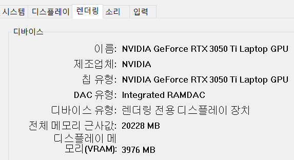

# Tensorflow 환경 설정

## 1. 윈도우 그래픽카드 관련 세팅

**tensorflow에 그래픽카드 연산을 사용할 수 있게 하기 위해 세팅을 해준다.**

- Nvidia 그래픽 드라이버 설치
    - - GPU를 지원하는 Tensorflow를 설치하기 위해 가장 먼저 NVidia 그래픽 드라이버를 설치
    - 그래픽 드라이버는 윈도우 dxdiag를 통해 확인할 수 있음
    - 확인한 GPU 유형에 맞는 그래픽 드라이버 다운로드([https://www.nvidia.co.kr/Download/index.aspx?lang=kr](https://www.nvidia.co.kr/Download/index.aspx?lang=kr))
        
        
        
        
        
- CUDA toolkit 설치
    - [https://developer.nvidia.com/cuda-toolkit-archive](https://developer.nvidia.com/cuda-toolkit-archive)
    - CUDA 11.2 버전 설치 : exe (local)로 설치
    **CUDA Toolkit 11.2.2**(March 2021), **Versioned Online Documentation**

- cuDNN 설치(nvidia 로그인을 해야 받을 수 있음)
    - **[Download cuDNN v8.1.0 (January 26th, 2021), for CUDA 11.0,11.1 and 11.2](https://developer.nvidia.com/rdp/cudnn-archive#a-collapse810-111)**
    - 압축해제 후 CUDA 폴더에 덮어쓰기를 해야함.
    
    cudnn 압축해제한 폴더이다.
    
    
    
    CUDA 경로에 위의 파일들을 덮어쓴다.
    
    
    

## 2. Tensorflow 2.20.1 설치

윈도우에서 GPU를 사용할 수 있는 tensorflow 버전은 2.11 부터는 지원이 끝났다. 따라서 아래 명령어로 tensorflow를 설치한다.

(물론 그 이상의 버전을 사용할 수는 있지만, TensorFlow 2.11 부터 WSL2에 TensorFlow를 설치하거나 tensorflow-cpu를 설치하고 선택적으로 TensorFlow-DirectML-Plugin을 시도해야함)

```python
# Anything above 2.10 is not supported on the GPU on Windows Native
pip install "tensorflow<2.11"
```

**왜 명세서와 스켈레톤 코드에 작성되어 있는 tensorflow 1.15-gpu 버전을 사용하지 않고 2버전을 사용하느냐?**

- 우선, 최신 그래픽드라이버가 설치된 ssafy 노트북에는 530.xx 버전 이상의 그래픽 드라이버가 사용되어 CUDA 11 버전 이상을 사용할 수 밖에 없는 상황이다.
- 하지만, tensorflow 1.xx 버전에서 지원하는 CUDA 10 버전 까지이다.
- 따라서, tensorflow 2.xx 버전을 설치하고 tensorflow 1.xx 코드를 적용할 수 있게 하는 방법을 사용할 것이다.

## 3. Tensorflow Object Detection API 설치

1. 바탕화면에 TF Object Detection API를 git을 이용해 다운받자.


1. Proto files compile
- Object Detection API에 있는 proto 파일을 compil 할 것임
- 먼저, protobuffer을 다운로드 받아야 함. 3.5 버전 이하로.
[https://github.com/protocolbuffers/protobuf/releases/tag/v3.20.0](https://github.com/protocolbuffers/protobuf/releases/tag/v3.20.0)
위 주소에서 Assets 토글을 열면 나오는 파일을 다운받으면됨
파일이름 → protoc-3.20.0-win32.zip
- 바탕화면에 압축해제를 합니다.

1. 실행
- 이전에 다운받은 API 해당 경로로 진입합니다.


- 해당 명령어를 실행합니다.(각자 노트북 환경의 폴더경로 및 파일명에 유의하여)

```bash
c:\Users\SSAFY\Desktop\protoc-3.20.0-win32\bin\protoc.exe object_detection\protos\*.proto --python_out=.
```


- Object Detection API Install(~models/research> 경로에서) 명령 실행

```bash
python setup.py build
```

```bash
python setup.py install
```

- 환경변수 설정을 한다. 이 부분에서 에러가 잘 남.


- 설치 확인(~models/research 에서)

아래 명령어가 잘 실행되면 잘 설치가 된 것이다.

```bash
python object_detection\builders\model_builder_test.py
```

하지만, 우리는 tensorflow 2 버전을 사용하기 때문에 에러가 분명 날 것이다. tf 1 언어를 알 수 없다는 에러가 나온다면 일단 성공했다고 생각하고 넘어간다. 만약 다른 에러가 나온다면 해결해줘야한다.